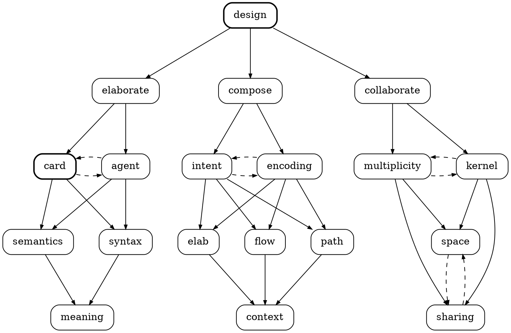

◊ design

Design as intentional bringing-into-being. Pattern recognition and reflection.

```dot
digraph mg {
    rankdir=TB;
    graph [overlap=false; splines=spline; nodesep=0.5; ranksep=1.0];
    node [shape=box; style=rounded; margin="0.2,0.1"];
    edge [arrowsize=0.6];

    design [shape=box; style="rounded,bold"; label="design"];
    
    elaborate [label="elaborate"];
    compose [label="compose"];
    collaborate [label="collaborate"];

    design -> elaborate;
    design -> compose;
    design -> collaborate;

    card [shape=box; style="rounded,bold"; label="card"];
    agent [label="agent"];
    elaborate -> card;
    elaborate -> agent;
    card -> agent [style=dashed];
    agent -> card [style=dashed];

    semantics [label="semantics"];
    syntax [label="syntax"];
    meaning [label="meaning"];
    card -> semantics;
    card -> syntax;
    agent -> semantics;
    agent -> syntax;
    semantics -> meaning;
    syntax -> meaning;

    intent [label="intent"];
    encoding [label="encoding"];
    compose -> intent;
    compose -> encoding;
    intent -> encoding [style=dashed];
    encoding -> intent [style=dashed];
    
    elab [label="elab"];
    flow [label="flow"];
    path [label="path"];
    intent -> elab;
    intent -> flow;
    intent -> path;
    encoding -> elab;
    encoding -> flow;
    encoding -> path;
    
    multiplicity [label="multiplicity"];
    kernel [label="kernel"];
    collaborate -> multiplicity;
    collaborate -> kernel;
    multiplicity -> kernel [style=dashed];
    kernel -> multiplicity [style=dashed];

    sharing [label="sharing"];
    space [label="space"];
    multiplicity -> sharing;
    multiplicity -> space;
    kernel -> sharing;
    kernel -> space;
    sharing -> space [style=dashed];
    space -> sharing [style=dashed];
    
    context [label="context"];
    elab -> context;
    flow -> context;
    path -> context;
    
    {rank=same; card; agent; intent; encoding; multiplicity; kernel;}
    
    {rank=same; semantics; syntax; elab; flow; path; space;}
    
    {rank=same; meaning; context; sharing;}
}
```

⊲ See: readme.md for operational frame.
