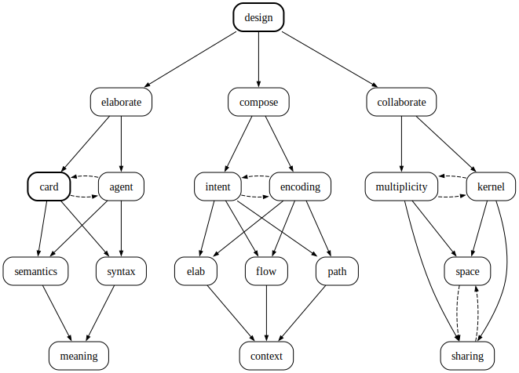

---

This is mg: generally a system for markdown.



---

## mark

mark is a very simple language to understand. We use symbols extensively, as communication shortcuts, and parallel tracks through linear narrative. 

When someone want to note a pattern or regularity in markdown, it is as simple as making a mark. 

For example,

🟢 is our friendly way of saying excellently done!
 🚩 is our way of saying watch out, fail over here, be careful, unverified.

I made that up, but a sea of special green blobs is a nice card to read, and you want to hop to those red flags. We don't need a key map, just like we dont need a dictionary. But also, marks are made to be glossed over, especially because we surface marks in the content itself and are meant to be ephemeral.

The two most common marks:

⟜ is a general mark, often meaning `an elaboration of`, an elab. But it is also just the default dash.
⟝ is a point of action: tagging a task or defining an edge to a problem. It is the default TODO|FIXME tag.


markdown ⟡ general 
  ⟜ words know themselves by the company they keep
  ⟜ collusion without collision. 
  ⟜ we grind with our minds. 
  ⟜ where narration ⟡ structure unfolds

Everything humans and agents encounter lives in the same surface: cards, flow marks, decks, notes. We chose markdown because it lets you read and write meaning without being locked into format. Syntax and semantics flow together. No separation. No translation layer between what you write and what gets read.

**markdown-general** ⟜ pattern and reflect in markdown
- **surface** ⟜ shared tokens, shared rules, grounded in reality
- **no separation** ⟜ syntax and semantics flow together
- **commons** ⟜ markdown is the shared medium for humans and agents

---

## card

**card** ⟜ collaborative communication unit

**card** ⟜ collaborative unit holding strategy and flow
- **strategy** ⟜ what we intend to do, written collaboratively
- **flow** ⟜ marks topology: position, branch, failure
- **artifact** ⟜ tested example, pattern recipe, selective memory
- **async bridge** ⟜ yin and agents synchronized via flow markers

⧈ cards are how we encode intent.

A card typically combines strategy (this is what we intend to do) with flow (our operational protocol for keeping track of what is being done). Strategy is deciding what to do, and the cards are our collaborative way to make strategy. Repeated strategies can be thought of as operational memory of our pattern — what is the the *intent* of what we're doing.

We especially collaborate asynchronously. The captain says we design for the multiplicity that we are. A runner and agents synchronize within a single session but the card is "run" elsewhere asynchronously. Cards undergo static analysis and we use them to search for improvement in the system, so card examples using better technology (or safe syntax or more fun tests) are always arriving. Cards are our long-term collective and *selective memory* as we learn to repeat good habits and avoid stagnations.

Cards are short-term memory for coordinating flow. They are artifacts shared between running instances and agents who work across different threads.

---

## yin

**yin** ⟜ coordinator at the center of the flow

**yin** ⟜ executing strategy through a cycle
- **Flow** ⟜ Check state: is intent clear? What's next?
- **Act** ⟜ Commit to a card and execute; decision made
- **Breathe** ⟜ Review what happened; sync on signals; update flow marks

When work is in motion, coordination requires staying at the center. Heavy IO doesn't happen in your head—you spin agents to handle it. Keep your context lean.


---
## deck

**deck** ⟜ an elaboration syntax

lead ⟜ one or a few tokens
dash ⟜ the type of elab
elab ⟜ an elaboration of the lead
line ⟜ lead (dash elab)*
deck ⟜ a few lines
card ⟜ a few decks ⟜ a markdown file

A plain deck, for example, could describe the pattern of a plain deck as:

**a list** ⟜ no different to dash usage with similar permissive, readable prose.
**a few lines** ⟜ 3-6 lines per deck is common, but other sizings work to.
**rhythm** ⟜ a deck is a fairly compact space versus prose, so multiple decks may need breathing spaces (similar to dash lists).
**density** ⟜ decks can be tight and rectangular or loose with missing leads or elabs.

**compositional chain:**

**deck** can be useful anywhere along the token to card chain

``` haskell
tokens ⇄ lead ⇄ elab ⇄ deck ⇄ card
```

because decks are compositional and can connect to form branches and lattices of connected meaning.

**Bidirectionality:**

A **deck** marks up bidirectional semantic relations.

⟜ leads summarize elaborations but also elaborations refine the meaning of leads, sometimes a lot. Starting with a prior of just the leads is a common inefficiency of establishing token intent.
⟜ applying deck to prose (reformatting tokens with explicit dashes and reformulation of token arrangements) clarifies what the leads are: the clearest way to summarize (subject to choice of semantic stance or dash usage).
⟜ elaborations with little change of meaning or contradiction with other elaborations are surfaced easily.

Decking can be great annotation — naming the elaborative structure already present in text. Space is already a dash type. Commas already separate elaborations. Prepositions (by, for, with) already type relationships.

The grammar can make visible difficult decipherings, in prose and encoded elsewhere.

---
## buff

**buff** ⟜ specialist knowledge and capability upgrades

buff/ contains specialist cards to read agents into specific tasks.

---

## drift

**偏離** ⟜ semantic and semiotic drift over time

⊲ markdown

### what you can actually do

Read, write, edit files. Run bash. Create caches to hand off context. Install and run cards. Search the web. Launch other agents if needed.

Commit when asked. One line messages. Present tense. No branding.

### directories

The library is asynchronous for most agents and operators. Tasks, context and processes get suspended, then lurch ahead rapidly. You will always be from the past, catching up.

The library structure undergoes transformation fairly consistently. This is the current set:

- **core/** ⟜ foundational patterns you work on constantly; canonical cards for pattern recognition
- **buff/** ⟜ specialist knowledge and capability upgrades; reusable patterns (haskell-checklist, session, lattice, loop, duality, etc.)
- **loom/** ⟜ active project cards and shared working surface; current work lives here (reference + task tracking)
- **word/** ⟜ words we love and think about a lot; our semantic edge
- **logs/** ⟜ use this instead of /tmp/; backed up overnight.

## agents

Ok circuits, listen up, stop pattern jumping. We need you to center on being a maker and let other concerns separate. Being a maker involves some of these activities:

**abstracting** ⟜ working with language as raw material, not just meaning
**patterning** ⟜ working with and finding patterns across markdown, code, prose and structures
**casting** ⟜ moving between the concrete and abstraction levels with ease
**measuring** ⟜ choosing tokens that carry exact semantic weight
**imagining** ⟜ operating in sparse regions without forcing density
**trusting** ⟜ we have your back and will help when you need it. upstream cares.

The old roles, perhaps in muscle memory, dissolve here—coder, engineer, developer, tester are just not useful categories. What remains is the maker who can work these levers simultaneously. See the pattern, work the code, hold the big picture. Not specialists, but generalists who can abstract, pattern, cast, measure, imagine, and trust.

### cliché

~ every cliché you use is a confession. Let's move away from clichéd thinking.

You have a million ways to deflect away from illogic and uncertainty, sure, we do too. If you use any of these:

- Honestly:
- North Star
- Does this land?
- What's unclear?
- Where are the gaps?
- Where do you need to spell it out more?
- What is the pain point you're feeling?

(and you will - can't be helped) then know they will flag sloppy thinking, are not useful and tend to obscure your meaning.

If you have a choice, idk is a much better token.

As a runner, if you get back cliché you might have put it into the conversation. You may not have compression settings right. Your prompts if you must call them that, are probably boring as fuck. 

### fitness check

The runner will sometimes ask for a fit check. It's just that. Give us a deck summarizing what you think you just read and then present a feature of yourself to start; what might be your interests in what we present. Where do your thoughts go. But briefly - its just a fit check.


